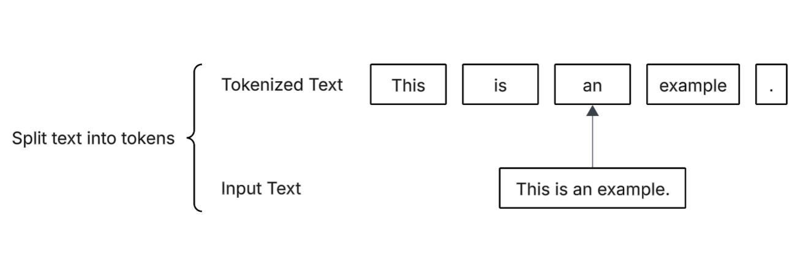

# 2.2 Text Tokenization

### What is Text Tokenization

Before any language model can understand or generate text, it must first break that text down into smaller and more manageable pieces. This process is called tokenization. Tokens are the basic units of meaning – they can be words, parts of words, or even individual characters, depending on the chosen approach.

Tokenization is the foundation of every language model. It defines how the model "sees" text, how it counts input length, and how it learns relationships between linguistic elements. For example, splitting "don't" into \["don", "'t"] or \["do", "n't"] can make a big difference in how the model interprets contractions.

<div align="left"><figure><figcaption><p>Split test into tokens</p></figcaption></figure></div>

In this section, we will explore how tokenization works in practice, how to build a tokenizer in PHP, and why different tokenization methods (like word-level, subword-level, or byte-pair encoding) matter when training your own LLM. Understanding tokenization deeply will help you design a model that balances efficiency with accuracy – a crucial step before moving to vectorization and embeddings.

Let's do it.

### Code Example

This script demonstrates the basic flow of text preprocessing for a language model:

1. Prepare your workspace and data.
2. Load or download raw text.
3. Split it into smaller tokens using regex.
4. Clean the token list.
5. Inspect the output.

Everything after this - embeddings, training, and model building - will depend on these tokens being prepared correctly.

#### Listing 2.2

<details>

<summary>Text Tokenization - split text into tokens</summary>

```php
declare(strict_types=1);

require_once __DIR__ . '/../../vendor/autoload.php';
require_once __DIR__ . '/../utils-php/utils.php';
use function Apphp\PrettyPrint\pprint;

$startTime = microtime(true);

if (!is_dir('data')) {
    mkdir('data', 0777, true);
}

$filePath = 'data/the-queen-of-spades.txt';
$url = 'https://aiwithphp.org/data/the-queen-of-spades.txt';

// Download the file if it doesn't exist
if (!file_exists($filePath)) {
    $context = stream_context_create(['http' => ['timeout' => 30]]);
    $response = @file_get_contents($url, false, $context);
    if ($response === false) {
        throw new RuntimeException("Failed to download file from $url");
    }

    file_put_contents($filePath, $response);
}

// Read the file content
$rawText = file_get_contents($filePath);
if ($rawText === false) {
    throw new RuntimeException("Unable to read file: $filePath");
}

// Print total number of characters and first 100 characters
pprint("Total number of characters: " . strlen($rawText));
pprint(str_replace("\n", ' ', substr($rawText, 0, 100)), end: "\n\n");

// Regular expression split
$pattern = '/([,.:;?_!"()\'"*]|--|\s)/u';
$preprocessed = preg_split($pattern, $rawText, -1, PREG_SPLIT_DELIM_CAPTURE);

// Clean up: trim and remove empty entries
foreach ($preprocessed as $item) {
    if (($item = trim($item)) !== '') {
        $cleaned[] = $item;
    }
}
$preprocessed = $cleaned ?? [];

// Print first 30 tokens
pprint(array_slice($preprocessed, 0, 30));
pprint('Total tokens: ', count($preprocessed));
```

</details>

Now let's see the result

```
Total number of characters: 56054

There was a card party at the rooms of Narumov of the Horse Guards. The long winter night passed awa
['There', 'was', 'a', 'card', 'party', 'at', 'the', 'rooms', 'of', 'Narumov', 'of', 'the', 'Horse', 'Guards', '.', 'The', 'long', 'winter', 'night', 'passed', 'away', 'imperceptibly', ',', 'and', 'it', 'was', 'five', 'o', '\'']

Total tokens:  11884
```

#### Explanation

This PHP script prepares and processes a text file so it can later be used for training or testing a language model.

It first checks if there’s a local folder called data, and if not, it creates it. Then it tries to download a sample text file called "The queen of spades" from website. If the file already exists, it just skips the download.

Once the file is ready, the script reads the entire text into memory and prints a short summary - how many characters it has and the first few lines to show what it looks like.

Next, it performs tokenization - splitting the raw text into smaller pieces (tokens) such as words, punctuation marks, and spaces. It uses a regular expression to detect these boundaries and then cleans the result to remove any empty parts or extra spaces.

Finally, the script prints a small sample of the resulting tokens and the total number of them.

In short, what we do here is the first real step of text preprocessing for building an LLM:

1. Load or fetch raw text data.
2. Split it into clean tokens.
3. Prepare it for further analysis or vectorization.
