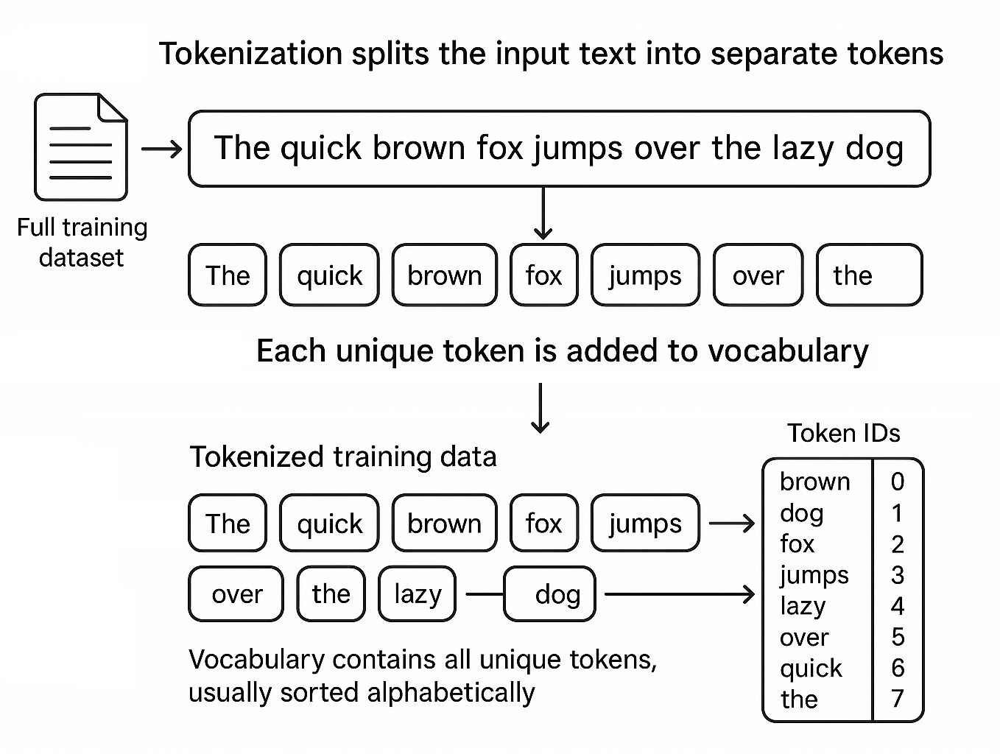

# 2.3 Converting tokens to token IDs

### **Converting Tokens**

Once we have a deterministic way to split raw text into tokens, the next essential step is converting those tokens into **token IDs**. Token IDs are simply integers that uniquely represent each token in our vocabulary. Neural networks cannot operate directly on text - they operate on numbers - so this conversion is foundational for building any GPT-style model.

In this chapter, you’ll learn:

* Why token IDs matter
* How to build a vocabulary from real text
* How to map tokens to IDs (and back)
* How to handle unknown tokens
* How our `SimpleTokenizerV1` and `SimpleTokenizerV2` implement token-to-ID conversion in pure PHP

<div align="left"><figure><figcaption></figcaption></figure></div>

### **What Is a Token ID?**

A **token** is an atomic unit of text:\
a word, a punctuation mark, or a meaningful sequence like `"--"`.

A **token ID** is an integer assigned to a token.\
Every unique token in the vocabulary receives exactly one integer index:

| Token    | Token ID |
| -------- | -------- |
| `The`    | 0        |
| `queen`  | 1        |
| `of`     | 2        |
| `spades` | 3        |
| …        | …        |

This mapping allows us to turn a sequence of words into a sequence of numbers that a model can learn from.

### **Building a Vocabulary from the Text**

Before converting anything into IDs, we must decide **which tokens exist** in our mini-GPT’s world. In this chapter, we use a real public-domain text - _The Queen of Spades -_ as our training corpus.

The code below reads or downloads the text file, tokenizes it, and builds a vocabulary:

```php
$pattern = '/([,.:;?_!"()\'"*]|--|\s)/u';
$preprocessed = preg_split($pattern, $rawText, -1, PREG_SPLIT_DELIM_CAPTURE);

// Clean up: trim and remove empty entries
foreach ($preprocessed as $item) {
   if (($item = trim($item)) !== '') {
      $cleaned[] = $item;
   }
}

// Collect unique sorted tokens
$allWords = array_values(array_unique($preprocessed));
sort($allWords);
pprint("Vocabulary size: " . count($allWords));
```

Result:

```
Vocabulary size: 2192
```

At this point:

* `$preprocessed` (later cleaned) contains the full tokenized text.
* `$allWords` contains an alphabetized list of **unique tokens**.
* Each token can be assigned an integer index based on its position in the sorted list.

This simple approach mirrors early NLP systems and is exactly how many introductory GPT tutorials begin.

### **Creating the Token → ID Mapping**

To convert tokens into IDs, we construct a PHP associative array:

```php
$vocab = [];
foreach ($allWords as $i => $token) {
    $vocab[$token] = $i;
}
```

Now `$vocab['Chance']` returns something like `40`, depending on sort order.

This mapping is passed into our tokenizer classes.

### **Implementing a Basic Tokenizer (SimpleTokenizerV1)**

`SimpleTokenizerV1` is a minimal, direct tokenizer:

* It splits text using the same pattern used during vocabulary creation.
* It cleans whitespace.
* If a token appears in the vocabulary, it is added to the ID list.
* If a token does _not_ appear in the vocabulary, it is discarded.

<details>

<summary>SimpleTokenizerV1</summary>

```php
class SimpleTokenizerV1 {
    private array $strToInt;
    private array $intToStr;

    public function __construct(array $vocab) {
        $this->strToInt = $vocab;
        // Create reverse mapping: int -> str
        $this->intToStr = array_flip($vocab);
    }

    public function encode(string $text): array {
        // Split on punctuation and whitespace, capturing delimiters
        $pattern = '/([,.:;?_!"()\'"]|--|\s)/u';
        $preprocessed = preg_split($pattern, $text, -1, PREG_SPLIT_DELIM_CAPTURE);

        // Clean up: trim and remove empty entries
        $cleaned = [];
        foreach ($preprocessed as $item) {
            $trimmed = trim($item);
            if ($trimmed !== '') {
                $cleaned[] = $trimmed;
            }
        }

        // Convert tokens to IDs
        $ids = [];
        foreach ($cleaned as $token) {
            if (isset($this->strToInt[$token])) {
                $ids[] = $this->strToInt[$token];
            }
        }
        return $ids;
    }

    public function decode(array $ids): string {
        // Convert IDs back to tokens
        $tokens = [];
        foreach ($ids as $id) {
            if (isset($this->intToStr[$id])) {
                $tokens[] = $this->intToStr[$id];
            }
        }

        // Join with spaces
        $text = implode(' ', $tokens);

        // Remove spaces before specified punctuation
        $text = preg_replace('/\s+([,.?!"()\'])/u', '$1', $text);

        return $text;
    }
}
```

</details>

#### Encoding Text into IDs

Here’s the essential part of `encode()`:

```php
foreach ($cleaned as $token) {
    if (isset($this->strToInt[$token])) {
        $ids[] = $this->strToInt[$token];
    }
}
```

If the token exists, it is converted into its integer ID.

#### Decoding IDs Back to Text

`decode()` performs the inverse operation:

```php
foreach ($ids as $id) {
    if (isset($this->intToStr[$id])) {
        $tokens[] = $this->intToStr[$id];
    }
}
```

After decoding, the tokens are joined and punctuation spacing is normalized.

#### Example: Encoding and Decoding

```php
$tokenizer = new SimpleTokenizerV1($vocab);
$text = "It's the last he painted, you know, Mrs. Gisburn said with pardonable pride.";

$ids = $tokenizer->encode($text);
pprint($ids);
pprint($tokenizer->decode($ids));
pprint($tokenizer->decode($tokenizer->encode($text)));
```

Result:

```
[107, 2, 1699, 1958, 1190, 1036, 1424, 4, 2186, 1176, 4, 6, 1703, 2155, 6]
It' s the last he painted, you know,. said with.
It' s the last he painted, you know,. said with.
```

Even this simple pipeline is enough to convert natural language into numerical form. However, you may notice that some tokens weren't found, such as `Mrs.`, `pardonable`, or `pride`. In next chapter we'll learn what to do with that.
