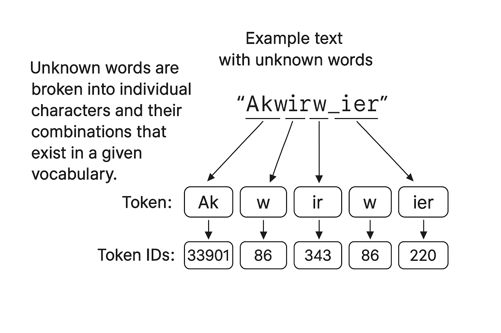

# 2.5 Byte Pair Encoding

In this section we examine a more sophisticated tokenization scheme based on the concept of Byte Pair Encoding (BPE). The BPE tokenizer was used to train large language models such as GPT-2, GPT-3, and the original ChatGPT model.

Implementing BPE can be relatively involved, so in practice we often rely on existing libraries. In our case it's [tiktoken-php](https://github.com/yethee/tiktoken-php) (PHP wrapper, that uses an external vocabularies).

Therefore, before using it, you need to install it:

```bash
composer require yethee/tiktoken
```

### What BPE is and Why It Matters

Byte Pair Encoding is a data-driven subword segmentation algorithm that finds a middle ground between character-level and word-level tokenization. Instead of representing text as full words or single characters, BPE builds a vocabulary of common subword units by repeatedly merging the most frequent pair of adjacent symbols (initially bytes or characters).

This approach has several advantages:

* **Efficiency.** BPE produces a compact vocabulary that can represent both common words and unknown words using subword units, reducing the number of out-of-vocabulary tokens.
* **Morphological awareness.** Because BPE often splits rare words into meaningful subpieces (prefixes, stems, suffixes), models can generalize morphological patterns across words.
* **Control over vocabulary size.** The number of merge operations determines the vocabulary size, allowing a direct trade-off between granularity and model size.

Example of BPE vocabulary:

<details>

<summary>Example of BPE vocabulary (code-search-ada-code-001)</summary>

```
IQ== 0
Ig== 1
Iw== 2
JA== 3
JQ== 4
Jg== 5
Jw== 6
KA== 7
KQ== 8
Kg== 9
Kw== 10
LA== 11
LQ== 12
Lg== 13
Lw== 14
MA== 15
MQ== 16
Mg== 17
Mw== 18
NA== 19
NQ== 20
...
IENvbGxpZGVy 50253
IGluZm9ybWFudHM= 50254
IGdhemVk 50255
```

</details>

### High-level Algorithm

1. Treat the training corpus as a sequence of symbols (usually characters or bytes). Initialize the vocabulary with all single symbols and the special end-of-text token if needed.
2. Count frequency of all adjacent symbol pairs across the corpus.
3. Find the most frequent pair and merge it into a new symbol. Replace all occurrences of that pair in the corpus with the merged symbol.
4. Add the merged symbol to the vocabulary and repeat steps 2–3 for the desired number of merges (or until frequency thresholds are met).
5. The final vocabulary defines the tokenizer: to encode new text, greedily match the longest subword tokens from the vocabulary (or use a deterministic algorithm that mirrors the training process).

Note that modern implementations add details such as handling whitespace robustly, treating special tokens, and using byte-level initialization to make the tokenizer language-agnostic.

<div align="left"><figure><figcaption><p>BPE tokenizers destroy unknown words about parts and manufacturer symbols</p></figcaption></figure></div>

### Training vs. Encoding

Training a BPE model requires scanning a large corpus and performing the repeated pair-merging process. Encoding using an already-trained BPE vocabulary is much cheaper: it typically uses greedy longest-match segmentation (or an efficient algorithm) to map input text to a sequence of token ids.

Because training is corpus-dependent, two BPE tokenizers trained on different datasets may segment the same word differently. For model reproducibility and interoperability it is therefore essential to publish the vocabulary and merge list along with the model weights.

### Practical Considerations

* **Byte-level BPE.** Many modern tokenizers operate at the byte level rather than Unicode characters. This ensures a reversible mapping from arbitrary byte sequences to tokens, which is useful for robustness across encodings.
* **Special tokens.** Reserve ids for special tokens such as padding, unknown, beginning/end tokens, and task-specific markers.
* **Vocabulary size.** Typical vocabularies for large language models range from tens of thousands to over fifty thousand tokens. The optimal size depends on the language mix, the morphology of target languages, and the available compute.
* **Unicode and normalization.** Decide whether to normalize Unicode (NFC/NFKC) before tokenization; choices here affect reproducibility.

### Example: Using a PHP Tokenizer Library

Below is a compact example demonstrating how to use an existing PHP tokenizer wrapper that exposes BPE-style encoders. The example shows how to instantiate an encoder provider, get a tokenizer for a specific model, encode a string to token ids, and decode the ids back to text.

#### Listing 2.5

```php
declare(strict_types=1);

require_once __DIR__ . '/../../vendor/autoload.php';

use Yethee\Tiktoken\EncoderProvider;
use function Apphp\PrettyPrint\pprint;

$startTime = microtime(true);

$encoder = new EncoderProvider();
$encoder->setVocabCache(__DIR__ . '/../../data');

$tokenizer = $encoder->getForModel('code-search-ada-code-001');

$text = "Hello, do you like tea? <|endoftext|> In the sunlit terraces of someunknownPlace.";
$tokens = $tokenizer->encode($text);
pprint($tokens);

$text = $tokenizer->decode($tokens);
pprint($text);
```

Result:

```
[15496, 11, 466, 345, 588, 8887, 30, 1279, 91, 437, 1659, 5239, 91, 29, 554, 262, 4252, 18250, 8812, 2114, 286, 617, 34680, 27271, 13]
'Hello, do you like tea? <|endoftext|> In the sunlit terraces of someunknownPlace.'
```

#### Explanation of the example

* `EncoderProvider` is a factory that returns a tokenizer suited to a specific model. Different models expect different vocabularies and token id mappings, so it is important to request the encoder that matches your model.
* The example encodes a mixed string that includes punctuation, an explicit end-of-text marker.
* The encoder returns a sequence of integer token ids. Decoding converts those ids back into the original text representation (or a canonicalized equivalent).

### When to use BPE vs. alternatives

While BPE is popular and battle-tested, alternative subword segmentation algorithms exist, such as SentencePiece (unigram language model) and WordPiece. Each has slightly different trade-offs:

* **BPE** tends to be simple, deterministic, and efficient to compute; it builds tokens by merging frequent symbol pairs.
* **Unigram (SentencePiece)** learns a probabilistic model over subwords and often yields slightly different segmentation that can be better for some languages.
* **WordPiece** is similar to BPE but uses a different objective when selecting merges.

In practice, the choice between these methods often depends on available tooling, compatibility with existing models, and empirical performance on the target tasks.

### GPT-2 and practical BPE implementations

GPT-2 used Byte Pair Encoding (BPE) as its tokenizer. This design allowed the model to break down words that were not present in its predefined vocabulary into smaller subword units or even individual characters. For example, if GPT-2's vocabulary did not contain the word "unfamiliarword", it could tokenize it into components such as \["unfam", "iliar", "word"] depending on the learned merge rules.

The original GPT-2 BPE tokenizer implementation can be found in OpenAI's public repository ([OpenAI's tiktoken](https://github.com/openai/tiktoken)). In this chapter, we rely on the BPE tokenizer provided by [**tiktoken-php**](https://github.com/yethee/tiktoken-php) library.

### Summary

Byte Pair Encoding provides a practical, efficient way to build subword vocabularies that enable language models to handle rare words, multilingual text, and open vocabularies. By relying on existing libraries for the heavy lifting – and by matching tokenizer vocabularies to model expectations – you can use BPE tokenizers safely and efficiently in production systems.
