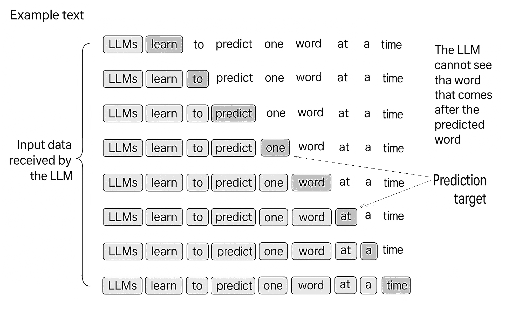

# 2.6 Data sampling with a sliding window

When we prepare training data for a Large Language Model (LLM), we cannot simply give the model the whole text at once. Instead, we must create many small examples that the model can learn from. Each example contains two parts:

1. **Input** – what the model receives
2. **Target** – what the model must predict

LLMs learn by predicting the _next token_ (a token can be a word or a sub-word) based on the previous ones. During training, the model repeatedly sees pairs of sequences:

* The **input sequence** is a block of text.
* The **target sequence** is the same block, but shifted one token to the right.

### **How the sliding window works**

Imagine that our text is very long — thousands of tokens. We need to break it into many smaller pieces of length _max\_length_, because models can only process limited context.

To do this, we use a **sliding window**:

1. Take a block of tokens from position _i_ to _i + max\_length_.
2. Then move the window forward by _stride_ tokens.
3. Take the next block.
4. Repeat until we reach the end of the text.

This method produces many overlapping samples. It helps the model learn because each example contains slightly different contexts.

For every window:

* The **input** contains tokens from positions `[i ... i + max_length - 1]`
* The **target** contains tokens from positions `[i+1 ... i + max_length]`

So the model learns to predict each next token inside the window.

<div align="left"><figure><figcaption><p>In this case, the input to the LLM consists of blocks of text that lead to input to the models, and the task of the LLM during training is to predict the whole word that follows the input block.</p></figcaption></figure></div>

### **Data Sampling With a Sliding Window — Step-By-Step Walkthrough**

Let’s walk through what this code is doing and why. We’ll build up the idea of a sliding-window dataset the same way you would inside a real GPT training loop.

#### **1. First, we tokenize the entire text**

Before we can create any training samples, we must turn the raw text into numbers.\
So we load the tokenizer and simply ask it to encode the complete book:

```php
$encoderProvider = new EncoderProvider();
$tokenizer = $encoderProvider->getForModel('code-search-ada-code-001');
$encText = $tokenizer->encode($rawText);
```

Now we know exactly how many tokens our dataset will contain.\
The script prints:

```
Total tokens: 13236
```

So that’s our raw material: 13k tokens we will soon slice into training samples.

#### **2. Let's take a small look at how next-token prediction works**

To get an intuition, we take a small piece of the token stream starting at position 50.\
From this chunk, we pick the first few tokens as input (`x`) and shift them by one position to form the target (`y`):

```php
$encSample = array_slice($encText, 50);
$contextSize = 4;
$x = array_slice($encSample, 0, $contextSize);
$y = array_slice($encSample, 1, $contextSize);
```

Result:

```
x:  [550, 1839, 11, 15063]
y:       [1839, 11, 15063, 351]
```

Here, every token in `x` wants to predict the token that follows it in `y`.

So the relationships are:

* 550 → 1839
* 1839 → 11
* 11 → 15063
* 15063 → 351

This is the basic training objective of GPT: for every input token, predict the next one.

#### **3. Now let's gradually grow the context**

Let’s take a bigger and bigger slice of the context and see what the next token should be each time.

```php
for ($i = 1; $i <= $contextSize; $i++) {
    $context = array_slice($encSample, 0, $i);
    $desired = $encSample[$i];
    pprint($context, " ----> ",  $desired);
}
```

Result:

```
[550]  ---->  1839
[550, 1839]  ---->  11
[550, 1839, 11]  ---->  15063
[550, 1839, 11, 15063]  ---->  351
```

Then we decode those tokens back into text so we can see what we’re predicting:

```php
for ($i = 1; $i <= $contextSize; $i++) {
    $context = array_slice($encSample, 0, $i);
    $desired = $encSample[$i];
    $context_decoded = $tokenizer->decode($context);
    $desired_decoded = $tokenizer->decode([$desired]);
    pprint($context_decoded, " ----> ", $desired_decoded);
}
```

Result:

```
had  ---->   won
had won  ---->  ,
had won,  ---->   ate
had won, ate  ---->   with
```

Now the idea becomes concrete: we build up a context, and the model should learn what word naturally comes next.

#### **4. Time to build a sliding-window dataset**

Now that we’ve seen the concept, we turn the entire text into many such training samples.\
We do this by sliding a window across the token list:

```php
for ($i = 0; $i < count($tokenIds) - $maxLength; $i += $stride) {
    $inputChunk = array_slice($tokenIds, $i, $maxLength);
    $targetChunk = array_slice($tokenIds, $i + 1, $maxLength);
}
```

Here’s what is happening:

* We take `maxLength` tokens as our input.
* Then we take the same window but shifted one step to the right as our target.
* After that, we slide forward by `stride` tokens and repeat.

If `stride` is smaller than `maxLength`, windows overlap.\
If `stride` equals `maxLength`, the windows don’t overlap — they “tile” the sequence.

This simple mechanism turns one giant token list into thousands of tiny training examples.

#### **5. Let's test it with very small samples**

We create a dataset with `maxLength = 1`, meaning each training sample is just a single token predicting the next one.

```php
$firstBatch = $dataset->getItem(0);
pprint("First batch input: ", $firstBatch[0]);
pprint("First batch target: ", $firstBatch[1]);

$secondBatch = $dataset->getItem(1);
pprint("Second batch input: ", $secondBatch[0]);
pprint("Second batch target: ", $secondBatch[1]);
```

Output:

```
First batch input:  [40]
First batch target: [198]

Second batch input: [373]
Second batch target: [257]
```

So the first relationship is:

```
40 → 198
```

then:

```
373 → 257
```

This is a good sanity check: the dataset produces exactly what we expect — each input token predicts the next token in the text.

#### **6. Now let’s create bigger windows: length 4, stride 4**

Here we tell the dataset:

* “Give me windows of size 4…”
* “…and after each window, jump forward exactly 4 tokens.”

This means no overlap — each block is its own chunk of text.

The inputs look like this:

```
[40, 198, 198, 1858]
[373, 257, 2657, 2151]
[379, 262, 9519, 286]
...
```

And the targets are shifted by one token:

```
[198, 198, 1858, 373]
[257, 2657, 2151, 379]
[262, 9519, 286, 13596]
...
```

Visually:

```
40     198     198    1858
 ↓       ↓        ↓       ↓
198    198     1858     373
```

Every row of input predicts the next row of target tokens.

This is precisely the structure GPT needs for autoregressive learning.

Below you may find the full code example:

#### Listing 2.6

<details>

<summary>Data sampling with a sliding window</summary>

```php
use Yethee\Tiktoken\EncoderProvider;

// GPT Dataset class - simulates PyTorch Dataset
class GPTDatasetV1 {
    private $inputIds = [];
    private $targetIds = [];

    public function __construct($txt, $tokenizer, $maxLength, $stride) {
        // Tokenize the entire text
        $tokenIds = $tokenizer->encode($txt);

        if (count($tokenIds) <= $maxLength) {
            throw new Exception("Number of tokenized inputs must be greater than max_length");
        }

        // Use a sliding window to chunk the text into overlapping sequences
        for ($i = 0; $i < count($tokenIds) - $maxLength; $i += $stride) {
            $inputChunk = array_slice($tokenIds, $i, $maxLength);
            $targetChunk = array_slice($tokenIds, $i + 1, $maxLength);

            $this->inputIds[] = $inputChunk;
            $this->targetIds[] = $targetChunk;
        }
    }

    public function getLength() {
        return count($this->inputIds);
    }

    public function getItem($idx) {
        if ($idx >= count($this->inputIds)) {
            throw new Exception("Index out of bounds");
        }
        return [
            $this->inputIds[$idx],
            $this->targetIds[$idx]
        ];
    }
}

// Create dataloader function
function create_dataloader_v1($txt, $maxLength = 256, $stride = 128) {
    $encoderProvider = new EncoderProvider();
    $tokenizer = $encoderProvider->getForModel('code-search-ada-code-001');
    $dataset = new GPTDatasetV1($txt, $tokenizer, $maxLength, $stride);

    return [
        'dataset' => $dataset,
        'tokenizer' => $tokenizer
    ];
}

// Resolve path to project root and data file
$projectRoot = dirname(dirname(dirname(__FILE__)));
$verdictPath = $projectRoot . "/data/the-queen-of-spades.txt";

// 1. Read the text
if (!file_exists($verdictPath)) {
    die("Error: File not found at $verdictPath\n");
}
$rawText = file_get_contents($verdictPath);

// 2. Tokenize the text
$encoderProvider = new EncoderProvider();
$tokenizer = $encoderProvider->getForModel('code-search-ada-code-001');
$encText = $tokenizer->encode($rawText);
echo "Total tokens: " . count($encText) . "\n";

// 3. Sample a context
$encSample = array_slice($encText, 50);
$contextSize = 4;
$x = array_slice($encSample, 0, $contextSize);
$y = array_slice($encSample, 1, $contextSize);

pprint("x: ", $x);
pprint("y:      ", $y);

// 4. Iterate over the context
echo "\n";
for ($i = 1; $i <= $contextSize; $i++) {
    $context = array_slice($encSample, 0, $i);
    $desired = $encSample[$i];
    pprint($context, " ----> ",  $desired);
}
pprint();

// 5. Decode the context
for ($i = 1; $i <= $contextSize; $i++) {
    $context = array_slice($encSample, 0, $i);
    $desired = $encSample[$i];
    $contextDecoded = $tokenizer->decode($context);
    $desiredDecoded = $tokenizer->decode([$desired]);
    pprint($contextDecoded, " ----> ", $desiredDecoded);
}

// 6. Create dataloader and iterate
echo "\nDataLoader Test:\n";

$dataloader = create_dataloader_v1($rawText, 1, 4, 1);
$dataset = $dataloader['dataset'];

// Get first batch
$firstBatch = $dataset->getItem(0);
pprint("First batch input: ", $firstBatch[0]);
pprint("First batch target: ", $firstBatch[1]);

// Get second batch
$secondBatch = $dataset->getItem(1);
pprint("Second batch input: ", $secondBatch[0]);
pprint("Second batch target: ", $secondBatch[1], end:"\n\n");

// Create dataloader with different parameters
$dataloader = create_dataloader_v1($rawText, 4, 4);
$dataset = $dataloader['dataset'];

pprint("DataLoader with max_length=4, stride=4:", end:"\n\n");
// Collect and print Inputs aligned
$inputRows = [];
for ($i = 0; $i < 8; $i++) {
    $batch = $dataset->getItem($i);
    $inputRows[] = $batch[0];
}
// Either label + matrix (supported) or label + multiple rows
pprint('Inputs:', $inputRows);

// Collect and print Targets aligned
$targetRows = [];
for ($i = 0; $i < 8; $i++) {
    $batch = $dataset->getItem($i);
    $targetRows[] = $batch[1];
}
pprint('Targets:', $targetRows);
```

</details>

## **Final View**

So what have we built?

* We took a long text.
* We tokenized it.
* We sampled small contexts to understand next-token prediction.
* Then we generated a full training dataset by sliding a window across all tokens.
* Each window became an input sequence, and the next-shifted window became its target.
* Changing `stride` changed how many overlapping samples we produce.

This sliding-window mechanism is the backbone of almost all GPT dataset creation.
